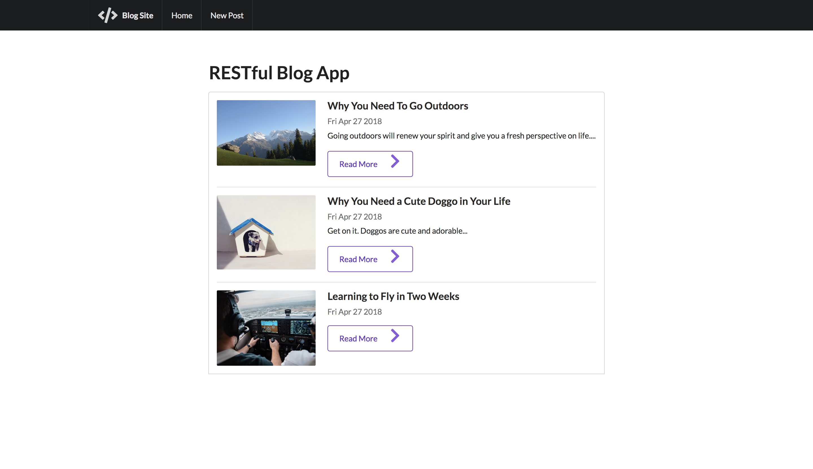

# SemanticBlog

SemanticBlog is a simple CRUD blogging web app built with Semantic UI, EJS, Express, MongoDB, and Mongoose. 

It is a small little exercise on RESTful routing, and it's part of Colt Steele's curriculae on his Udemy [course](https://www.udemy.com/the-web-developer-bootcamp/learn/v4/overview).

### Requirements

You'll need to have the following software installed on your computer:
* Node.js
* MongoDB

### Getting Started

First you'll want to open a `Terminal` and run the Mongo daemon with the `mongod` command.

Then, at the root of the project directory run the following commands:

`npm install`

`node app.js`

You can now create, edit, delete, and browse blog entries at `http://localhost:3000/`.
